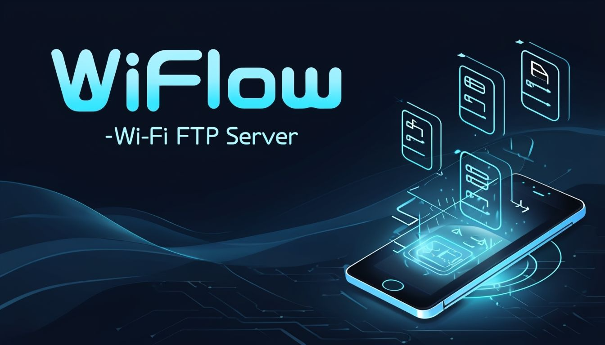
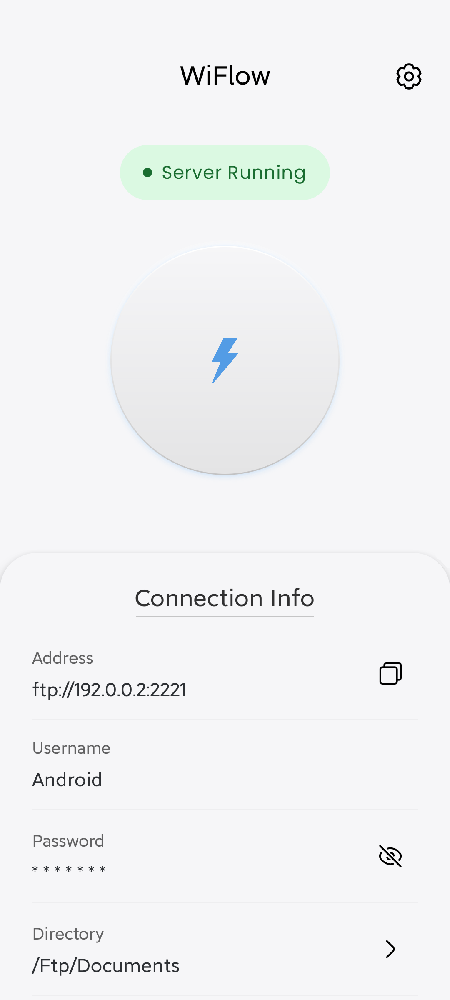
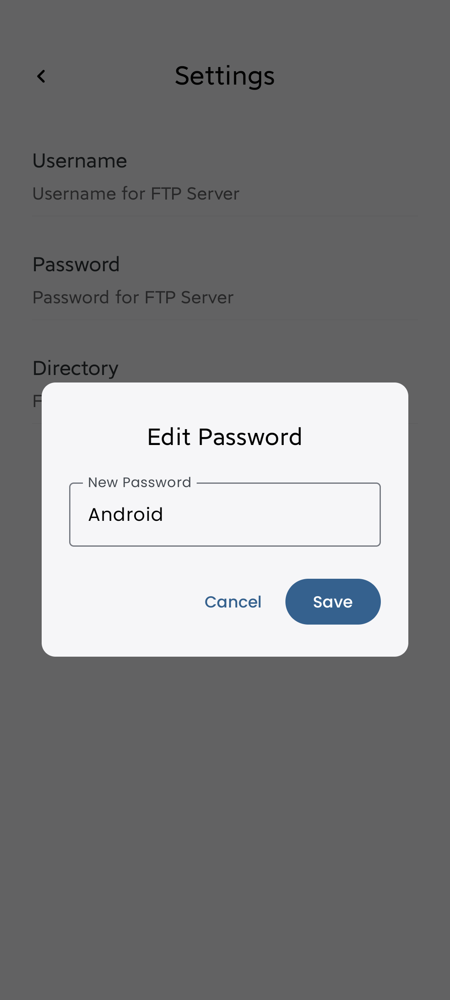
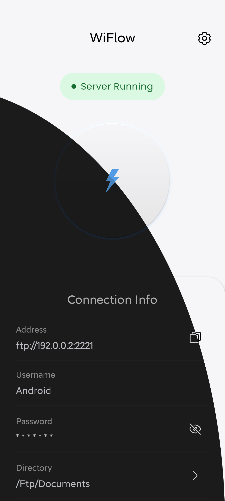

# WiFlow - Wi-Fi FTP Server ⚡

## 🚀 About WiFlow

WiFlow turns your Android device into a **Wi-Fi FTP server**, allowing you to transfer files
seamlessly between your phone and computer over a local network—**no cables required**.

Developed WiFlow, a robust Wi-Fi FTP server application facilitating seamless wireless file
transfer.

- Created a robust and secure FTP server architecture that ensures fast and reliable file transfers.
- Designed a scalable solution that helps users easily manage and share large files and data.

---

## 📸 Screenshots

| Home Screen                                        | Settings                                                   | Dynamic UI                                          |
|----------------------------------------------------|------------------------------------------------------------|-----------------------------------------------------|
|  |  |  |

---

## ✨ Features

✅ **Wireless File Transfer** – Move files between devices over Wi-Fi.  
✅ **Full FTP Server** – Upload, download, rename, and delete files.  
✅ **Access Internal Storage** – Manage all files in one place.  
✅ **Secure & Background Operation** – Keep the server running while using your phone.  
✅ **Lightweight & Fast** – Minimal resource usage with a simple UI.

---

## 📥 Download WiFlow

WiFlow is available on **Google Play**:

---

## ⚙️ How to Use

1. **Open WiFlow** and tap **Start Server**.
2. Connect to the same **Wi-Fi network** as your computer.
3. Use any **FTP client** (FileZilla, Windows Explorer, etc.) and enter the displayed **FTP address
   **.
4. Start transferring files wirelessly! 🚀

---

## 🛠️ Built With

- **Kotlin** & **Jetpack Compose** for modern Android development.
- **Apache FTP Server Library** for seamless file transfers.
- **Foreground Service** to ensure uninterrupted operation.
- **UDF & ViewModel** for efficient state management.
- **Dependency Injection** for scalable and maintainable architecture.

---

## 🤝 Contributing

Contributions are welcome! Feel free to **fork** this repository and submit a **pull request**.

---

## 📄 License

WiFlow is licensed under the **MIT License**.

---

## 📬 Contact

Have feedback or questions? Reach out via [LinkedIn](https://www.linkedin.com/in/senthil-sens) or
open an issue on GitHub.

---

**Enjoy hassle-free file transfers with WiFlow! 🚀**
